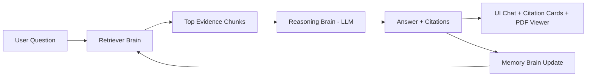
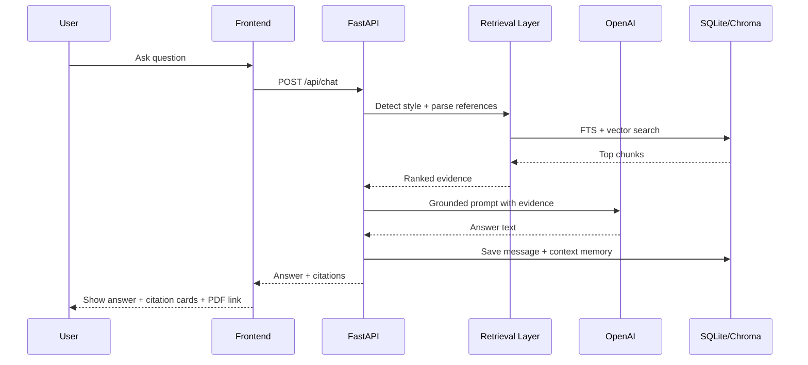

# Tartam AI Chatbot: System Guide (Layman Version)

## 1) What This Product Does (in 60 seconds)
This product is a scripture-focused chatbot for Tartam documents. You ask a question in everyday language (Hindi, Gujarati, English, or Roman style like `kaise ho` / `kem cho`), and the system finds the most relevant chopai and meaning from your PDFs, then explains the answer in a clear way. It also shows source citations so you can see exactly where the answer came from, instead of blindly trusting a generated reply.

## 2) What We Use (Tech Stack in simple words)
- Frontend (what you see in browser): Next.js + React + Tailwind CSS
- Backend (server logic): FastAPI (Python)
- LLM and embeddings: OpenAI (`gpt-5.2`, `text-embedding-3-large`)
- Search layer: Chroma (vector search) + SQLite FTS (keyword search)
- Storage: SQLite (chat history, thread data, context memory, metadata)
- PDF viewing in UI: `react-pdf`

## 3) System Design in Basic Terms (3-Brain Model)
Think of the app as 3 brains working together:

1. Retriever Brain
- Finds possible relevant lines/chunks from the corpus.
- Uses both meaning search (vector) and exact/keyword search (FTS).

2. Reasoning Brain (LLM)
- Reads the best retrieved chunks.
- Writes a human-friendly explanation in your language style.
- Stays grounded to source context.

3. Memory Brain
- Remembers conversation context by thread/session.
- Tracks what granth/prakran/chopai you were discussing so follow-ups stay relevant.

## 4) Full User Query Flow (Step-by-step)
When you ask something, this is what happens:

1. Input capture
- Your message comes from the web chat input.

2. Language/style detection
- System detects if your text is Hindi, Gujarati, English, Hindi Roman, or Gujarati Roman.

3. Query understanding
- It tries to identify references like granth name, prakran number/range, chopai number.

4. Hybrid retrieval
- Runs keyword search in SQLite FTS.
- Runs semantic search in vector DB (Chroma).
- Combines and ranks both result sets.

5. Evidence filtering
- Keeps strongest chunks and removes weak/irrelevant matches.

6. Grounded answer generation
- LLM creates explanation using retrieved evidence.

7. Response rendering
- UI shows answer text + inline citation cards.
- Clicking a citation opens related PDF page on the right viewer.

8. Memory update
- Thread history and compact context memory are stored for follow-up continuity.

## 5) How We Handle 5 Language Modes
Supported user style modes:
- Hindi (Devanagari)
- Gujarati (Gujarati script)
- English
- Hindi in Roman text (example: `kaise ho`)
- Gujarati in Roman text (example: `kem cho`)

How behavior works:
- In `auto` mode, the system detects your input style.
- It tries to answer in the same style by default.
- You can manually choose another style.

## 6) How We Avoid Hallucinations
Main safeguards:
- Citation-first behavior: answer must come from retrieved source chunks.
- If evidence is weak, bot should return a "not found clearly" type response.
- Citation cards show granth/prakran/page so user can verify.

Important note:
- This reduces hallucinations a lot, but extraction quality (OCR/encoding) can still affect results.

## 7) How Session/Thread Memory Works
There are 3 memory layers:

1. Message history
- Full chat messages in a thread (user + assistant).

2. Reference context memory
- Current granth/prakran/chopai state carried across turns.
- Helps follow-up queries like "what about chaupai 4".

3. Compact summary memory
- Short summary + key facts from earlier turns.
- Helps keep continuity without sending full long history every time.

## 8) Where Accuracy Can Fail Today
Common weak points:
- Garbled text extraction from some PDF pages.
- OCR may be required for readable text.
- Unknown or not-parsed prakran labels in some chunks.
- Exact reference mismatch when query asks highly specific chopai but metadata is weak.

What improves this:
- Better OCR coverage
- Better parsing rules for prakran/chopai markers
- Cleaner corpus extraction

## 9) How Costing Works (Layman)
Per prompt, cost is not just one call. It can include multiple line items:
- planning call
- embeddings calls
- answer generation call
- memory update call
- optional conversion/OCR calls

Simple cost math:
- USD cost = sum of token-based costs of each model call
- INR cost = USD total x current USD/INR rate

FX handling:
- USD/INR rate is fetched from a live source and cached.
- If live fetch fails, cached rate is used.

Why costs differ per prompt:
- Long questions use more tokens.
- More retrieval/embedding work increases cost.
- OCR or conversion adds extra calls.

## 10) What Gets Stored Locally
Stored in local SQLite/Chroma:
- Ingested scripture chunks + metadata
- Chat thread messages
- Session context and compact memory
- Retrieval metadata and citations
- (When enabled) usage/cost records

Privacy basics:
- Local app data stays on your machine by default.
- API key is read from local `.env`.

## 11) Glossary (Simple)
- RAG: Retrieval-Augmented Generation, meaning "find source text first, then explain".
- Embedding: Numeric representation of text used for semantic search.
- Chunk: Small text piece stored for retrieval (chopai + meaning + metadata).
- Citation: The source reference shown with answer.
- Prakran: A section/chapter grouping inside a granth.
- Chopai/Chaupai: Verse unit used in these texts.
- Grounding: Keeping answer tied to source evidence.
- OCR: Reading text from scanned/image-like PDF pages.
- Thread: One chat session/conversation.

## 12) FAQ
### Q1) Why did I get an answer earlier even without API key?
If LLM is not configured, some systems can still return retrieval-based fallback text. But proper explanatory reasoning requires a working LLM key and model access.

### Q2) Why do I still see "Unknown Prakran" in some places?
That usually means parser could not confidently detect prakran from extracted text, often because source text was garbled or OCR was weak.

### Q3) Why can I get "not found" even when text exists in PDFs?
Because the system needs confident, retrievable, and readable evidence. If extraction/metadata is noisy or reference is too ambiguous, it can fail safely instead of hallucinating.

---

## Component Table (Component -> Job -> Why needed)

| Component | Job | Why needed |
|---|---|---|
| Frontend (Next.js/React) | Chat UI, citation cards, PDF panel | Gives usable experience to user |
| FastAPI Backend | Orchestrates query, retrieval, generation, persistence | Core business logic and APIs |
| SQLite FTS | Keyword/exact text search | Strong match for literal terms and references |
| Chroma Vector DB | Semantic similarity search | Finds meaning-level matches beyond exact words |
| OpenAI LLM (`gpt-5.2`) | Explains retrieved context in natural language | Converts raw evidence into understandable answers |
| OpenAI Embeddings (`text-embedding-3-large`) | Creates vectors for semantic retrieval | Enables better recall for multilingual queries |
| Session Memory Store | Keeps thread context and compact history | Better follow-up continuity |
| `react-pdf` Viewer | Opens source page from citation | Trust and verification by user |

## Referenced APIs
- `POST /api/chat`
- `GET /api/history/{session_id}`
- `GET /api/threads`
- `GET /api/pdf/{citation_id}`
- `POST /api/convert`
- `GET /api/health`

## Current Model Defaults (as configured)
- `OPENAI_CHAT_MODEL=gpt-5.2`
- `OPENAI_EMBEDDING_MODEL=text-embedding-3-large`
- `OPENAI_VISION_MODEL=gpt-5.2`
